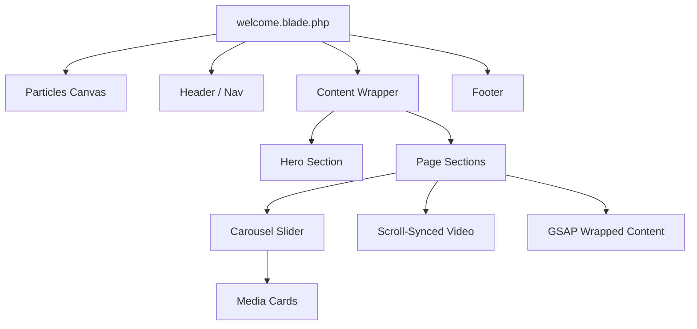

# Phase 1 & 2: Cleanup and Component Implementation

### Overview & Goals
The goal is to transition `blhamm.com` from its experimental horizontal/sticky layout to a modular, vertical architecture. This involves a complete cleanup of legacy code followed by the implementation of a robust library of Livewire Volt components. This work will bring the project to a stable "Base Initial Commit" state.

### Scope
- **In Scope:**
    - **Phase 1 Reset:** Stripping `welcome.blade.php` and `app.js` of legacy sticky scroll panels and associated GSAP triggers.
    - **Phase 2 Structural Components:** `Header`, `Footer`, `Content` (wrapper), and `SectionNav`.
    - **Phase 2 Media Components:** `Hero`, `Carousel`, `Card`, `VideoComponent`, and `Modal`.
    - **Animation & Logic:** `GsapWrapper` for declarative animations and a custom full-screen Intro Animation.
    - **Global Features:** Dark/Light mode toggle integration.
- **Out of Scope:**
    - Deployment configuration (handled later).
    - Advanced backend data models.
    - Final page copy/content.

# Technical Design

### Current Implementation
- **Framework:** Laravel 12, Livewire 3 (Volt), Flux UI, Tailwind CSS v4.
- **Libraries:** GSAP (Animation), Lenis (Smooth Scroll), Custom Particles.
- **State:** `welcome.blade.php` contains legacy sticky sections that conflict with the new vertical flow.

### Proposed Changes
1. **Welcome Reset:** Strip `welcome.blade.php` down to the particle canvas and intro typing animation. Remove all `.sticky-panel` sections.
2. **Component Architecture:** All components are built as Livewire Volt (single-file) components.
3. **GSAP Strategy:** 
    - Use `GsapWrapper` to encapsulate `ScrollTrigger` logic.
    - `VideoComponent` maps scroll progress to `currentTime` via GSAP.
4. **Flux Integration:** Use Flux UI components where appropriate (e.g., `Modal`, `Dropdowns`) to ensure accessibility.
5. **Section Nav Modes:** `SectionNav` will support `tabs`, `pill`, `sticky`, `stacked`, and `anchor links` via props.

### File Structure
- `resources/views/livewire/`:
    - `header.blade.php`
    - `footer.blade.php`
    - `content.blade.php`
    - `section-nav.blade.php`
    - `section-nav-item.blade.php`
    - `gsap-wrapper.blade.php`
    - `hero.blade.php`
    - `carousel.blade.php`
    - `card.blade.php`
    - `video-component.blade.php`
    - `modal.blade.php`

### Architecture Diagram

# Testing

### Validation Approach
- **Phase 1 Verification:** Ensure clean vertical scroll and functional global features (dark mode).
- **Component Stress Test:** Verify Carousel responsiveness and Modal accessibility.
- **Animation Smoothness:** Check GSAP scrub performance, especially for the VideoComponent.